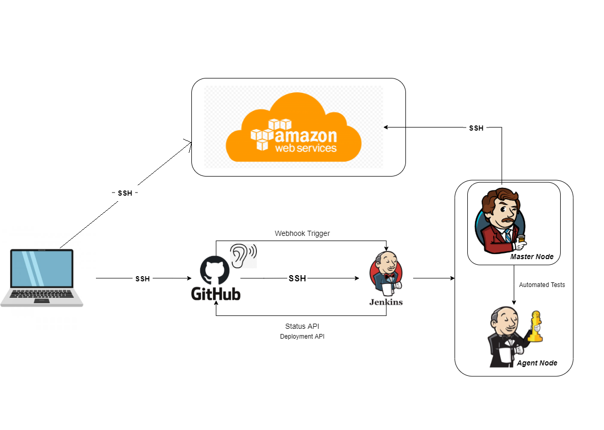

# CI/CD

## What is CI/CD?

CI/CD stands for continuous integration and continuous deployment. It is the automation of the manual human intervention needed to get new code committed into production. This includes:

- Building
- Testing
- Deploying
- Infrastructure provisioning 

The CI/CD pipeline takes code that has changes and automatically tests and pushes it for delivery and deployment. This minimises downtime and helps code to be released faster. As applications become larger CI/CD can decrease development complexity.

[DevOps Culture and CICD](https://medium.com/@ahshahkhan/devops-culture-and-cicd-3761cfc62450)

**Continuous integration** is the practice of integrating all your code changes into the main branch of a shared source code repository early and often, automatically testing each change when you commit or merge them, and automatically kicking off a build. With continuous integration, errors and security issues can be identified and fixed more easily, and much earlier in the development process.

**Continuous delivery** is a software development practice that works in conjunction with CI to automate the infrastructure provisioning and application release process.

Once code has been tested and built as part of the CI process, CD takes over during the final stages to ensure it's packaged with everything it needs to deploy to any environment at any time. CD can cover everything from provisioning the infrastructure to deploying the application to the testing or production environment.

**Continuous depolyment** is the step after continuous delivery. This proccess takes evry change that passes the production pipline and releases to customers. There is no human interaction and only a failed test will prevent the change going to production.

## Why Jenkins?

Jenkins is an open source continuous integration/continuous delivery and deployment (CI/CD) automation software DevOps tool written in the Java programming language. It is used to implement CI/CD workflows, called pipelines.

While Jenkins doesn't eliminate the need to create scripts for individual steps, it does give you a quicker and more robust way to integrate your entire chain of build, test, and deployment tools than you could easily build yourself.

Benefits:

1. Open source and free
2. Plug ins and intergration 
3. Its can be hosted on any OS
4. Community support
5. Integration with other CI/CD platforms
6. Centralised working
7. Easy to debug
8. Takes less time - continous integration
9. Supports different source code management (git, svn)
    

## Other tools that can be used for CICD:

- Travis Ci
- CircleCi
- TeamCity
- GitLab
- Buddy
- Bamboo
- Azure DevOps Server

## Why build a pipeline?

With a CI/CD pipeline, development teams can make changes to code that are then automatically tested and pushed out for delivery and deployment. By automating the process, the objective is to minimize human error and maintain a consistent process for how software is released. If at any point a stage fails the next stages will also fail.

One of the most exclusive benefits of a CI/CD pipeline is that it leads to the quick and easy rollback of code changes if there are any issues in the production environment after a release. If any new code change breaks a feature or general application, you can revert to its previous stable version right away.

## Business value?

CI/CD pipeline reduces human intervention across the DevOps lifecycle by automating the handoffs, version controlling, source code management, deployment processes, and testing, among others. This significantly saves the time and money required to develop and deliver high-quality software.

CI/CD has enabled many organizations to release on a more frequent basis without compromising on quality. With CI/CD, code changes are shepherded through an automated pipeline that handles the repetitive build, test and deployment tasks and alerts you about any issues.

