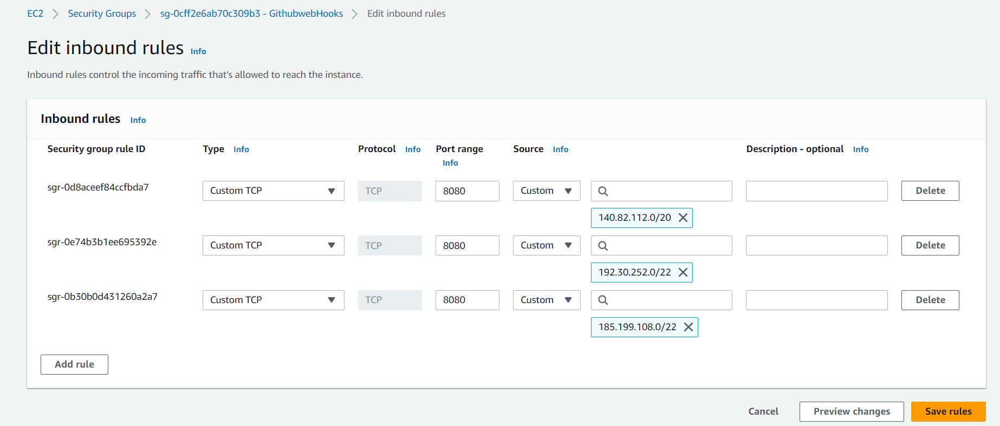

# How to create a Jenkins Server

To start I followed this [link](https://www.jenkins.io/doc/tutorials/tutorial-for-installing-jenkins-on-AWS/) on how to set up the AWS instance and security groups. However, it used a different operating system, I need to use ubuntu 18.04, so I found some other links which used this too.

1. Go to AWS and create a security group which allows HTTP, SSH, 8080 (jenkins port) and 9418 (github port)
Or you can do this: 

2. Launch an instance using the same configuration as I used for the app but use this new security group
3. Connect to the instance in gitbash

4. Install Java - [Install Java](https://www.digitalocean.com/community/tutorials/how-to-install-java-with-apt-on-ubuntu-18-04#installing-specific-versions-of-openjdk)

5. Install Jenkins - [Install Jenkins](https://www.digitalocean.com/community/tutorials/how-to-install-jenkins-on-ubuntu-18-04)

My Jenkins: http://3.252.45.241:8080/  This is the public IP of my AWS instance which has the jenkins server on it with port 8080 for jenkins.

6. Go to security -> Git Host Verification strategy and pick No verification i think this allows all connections to github?
7. Install the plugin NodeJS
8. Go to JENKINS_URL/configureTools [NodeJS documentation](https://plugins.jenkins.io/nodejs/)
9. Add a nodejs environment - give it a name and set the version to 12.0.0. This will be used in the CI job
10. Add SSH agent plugin
11. Set up a new webhook in github for the new Jenkins IP
12. Follow the CI CD pipeline from the readme.md
